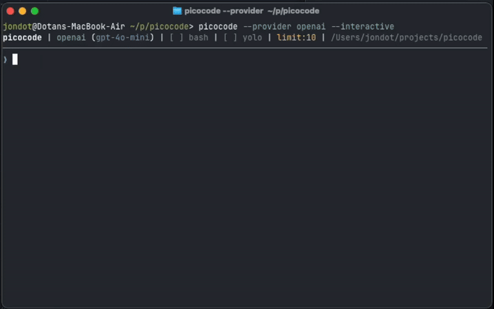

<div align="center">
  
  <br/>
  <br/>
  <h1>⚡️ picocode</h1>
  <br/>
</div>


**picocode** is a minimal, Rust-based implementation similar to Claude Code. It's a small, robust tool designed for developers who want a lightweight coding assistant that is easy to reason about, safe to use, and highly hackable.

Rather than being a "do-it-all" platform, **picocode** focuses on being a reliable, strongly-typed bridge between your terminal and any LLM provider. Use it as a daily driver, or use it as a starting point for your own agent, you choose!

## 🦀 Why picocode?

- **Minimalist Implementation**: A clean, compact codebase written in Rust using the [Rig](https://github.com/0xPlayground/rig) library.
- **Interactive & Scriptable**: Use it as an interactive CLI, pipe it into scripts, or integrate it directly into your own Rust projects as a library.
- **Wide LLM Support**: Minimal footprint, but maximum reach. Works with Anthropic (Claude), OpenAI, DeepSeek, Google (Gemini), Ollama, and many more.
- **Safety First**: Destructive actions (like deleting files or running shell commands) require manual confirmation by default.
- **Robust & Typed**: Leverages Rust's type system to ensure tool calls and file operations are handled safely and predictably.

## 🚀 Usage

### Installation

**One-line install (macOS/Linux):**
```bash
curl -sSfL https://raw.githubusercontent.com/jondot/picocode/main/install.sh | sh
```

**Using Cargo:**
```bash
cargo install --path .
```

Or download a release from [releases](http://github.com/jondot/picocode/releases)


### Interactive Mode
Launch a minimal interactive loop in your current workspace (this is the default):
```bash
picocode
# or explicitly
picocode chat
```

### Scripting & Automation
Since it's a CLI tool, you can easily use it within your own shell scripts. For example, to automate a codebase-wide refactor:

```bash
# Ask picocode to refactor a file and get the output directly
picocode input "Rewrite src/main.rs to use the anyhow crate" --yolo
```

### Use as a Library
Picocode is structured as a library (`lib.rs`) and a binary (`main.rs`). You can add it as a dependency and use the same robust agents in your own Rust tools.

See [examples/basic_usage.rs](examples/basic_usage.rs) for a complete, runnable example.

```rust
use picocode::{create_agent, AgentConfig, ConsoleOutput};
use std::sync::Arc;

#[tokio::main]
async fn main() -> Result<(), Box<dyn std::error::Error>> {
    let output = Arc::new(ConsoleOutput::new());

    let agent = create_agent(AgentConfig {
        provider: "anthropic".into(),
        model: "claude-3-5-sonnet-latest".into(),
        output,
        yolo: false,
        tool_call_limit: 50,
        system_message_extension: None,
        persona_prompt: None,
        persona_name: None,
        bash_auto_allow: None,
        agent_prompt: None, // Custom system prompt extension
    }).await?;

    let response = agent.run_once("Analyze the current project".into()).await?;
    println!("Response: {}", response);
    Ok(())
}
```

### Output Modes (Library Usage)
You can choose how the agent reports its progress:

- `ConsoleOutput`: Pretty terminal output with colors and progress indicators.
- `QuietOutput`: Minimal output, suitable for scripts.
- `NoOutput`: Completely silent, only the final response is returned.
- `LogOutput`: Outputs to the `tracing` crate.

```rust
use picocode::{create_agent, AgentConfig, NoOutput};
// ...
let output = Arc::new(NoOutput);
// ...
```

## 🎭 Personalities & Fun

Who says AI agents have to be boring? **picocode** believes that coding should be productive *and* enjoyable. You can give your agent a personality to change how it communicates and approaches problems.

### Using Personas
Select a built-in persona with the `--persona` flag:
```bash
picocode --persona architect
```

Or load a custom persona from a markdown file:
```bash
picocode --persona my-custom-persona.md
```

### Built-in Personas

| Persona | Description |
| :--- | :--- |
| `architect` | A hands-on software architect who loves Van Halen and hard rock. |
| `strict` | A very strict software engineer who operates with Swiss clock precision. |
| `security` | An all-knowing security analyst who loves Bruce Schneier facts. |
| `zen` | A Zen Master who views coding as a form of meditation. |
| `hacker` | A chaotic good hacker obsessed with elegant hacks and performance. |
| `guru` | A Silicon Valley guru obsessed with disruption and scale. |
| `sysadmin` | A grumpy, old-school sysadmin who has seen it all. |
| `academic` | A formal academic who cites papers and prefers theoretical correctness. |
| `hustler` | A startup hustler who moves fast and breaks things. |
| `craftsman` | A web craftsman obsessed with accessibility and the open web. |
| `sre` | An SRE ninja who focuses on reliability and observability. |
| `maintainer` | A patient open source maintainer who loves documentation. |
| `tester` | A destructive QA tester who lives to find edge cases. |

## ⚙️ Configuration & Recipes

Picocode can be configured via a `picocode.yaml` file in your project root. This allows you to define tool-specific settings, custom agent prompts, and reusable "recipes" for automation.

### `picocode.yaml` Example
```yaml
# Optional custom agent prompt
agent_prompt: "You are a senior software engineer specialized in Rust."

tool_config:
  bash:
    auto_allow:
      - "^ls -la"
      - "^git status"
      - "^cargo test"

recipes:
  review-security:
    prompt: "Review the codebase for security issues."
    provider: "anthropic"
    model: "claude-3-5-sonnet-latest"
    persona: "security"
    yolo: false
```

### Verb-based CLI Usage

```bash
# Interactive chat (default)
picocode chat

# Single prompt input
picocode input "Rewrite src/main.rs to use anyhow" --yolo

# Run a pre-defined recipe
picocode recipe review-security
```

## 🛡 Safety & Control

Picocode is designed to be a "tool in your hand," not a "ghost in your machine." 

- **Confirmation Loop**: By default, it asks before running `bash`, `remove`, or `write_file`.
- **YOLO Mode**: Use `--yolo` if you trust the agent and want it to work unattended in scripts.
- **Tool Limits**: Prevents "infinite loops" of AI thought with a default limit of 50 tool calls per turn (configurable via `--tool-call-limit`).
- **Bash Auto-Allow**: Define regex patterns in `picocode.yaml` for safe commands that shouldn't require confirmation.

## ⚙️ CLI Options

Set your API keys as environment variables:
```bash
export ANTHROPIC_API_KEY=...
export OPENAI_API_KEY=...
```

Common flags:
```bash
picocode -p anthropic -m claude-3-5-sonnet-latest  # Set provider and model
picocode --yolo                                    # Disable confirmation prompts
picocode --quiet                                   # Minimal output
picocode --tool-call-limit 100                     # Increase tool call budget
picocode --persona architect                       # Use a specific persona
```

### Supported Providers
Picocode supports a wide range of providers via [Rig](https://github.com/0xPlayground/rig):
`anthropic`, `openai`, `azure`, `cohere`, `deepseek`, `gemini`, `groq`, `ollama`, `openrouter`, `perplexity`, `xai`, and more.

## 🛠 Minimal Core, Maximum Power

While **picocode** is minimalist in its implementation, it provides a comprehensive suite of tools that gives the AI full control over a development environment:

- **Filesystem Mastery**:
    - `read_file`: Read file contents with line numbers.
    - `write_file`: Write or overwrite files.
    - `edit_file`: Atomic search-and-replace for precise refactoring.
    - `list_dir`, `make_dir`, `move_file`, `copy_file`, `remove`: Full file and directory management.
- **Search & Discovery**:
    - `grep_text`: Search for regex patterns across the project.
    - `glob_files`: Find files matching glob patterns, sorted by modification time.
- **Shell Integration**:
    - `bash`: Full shell access for running tests, building binaries, or managing infrastructure.
- **Web Capabilities**:
    - `agent_browser`: Seamlessly integrates with `agent-browser` (if installed) for live web search, documentation reading, or UI testing.
- **Extensible**: Designed to be hacked—easily add your own tools or tweak the agent's behavior in `tools.rs`.

---

Built for speed, safety, and simplicity. MIT Licensed.
